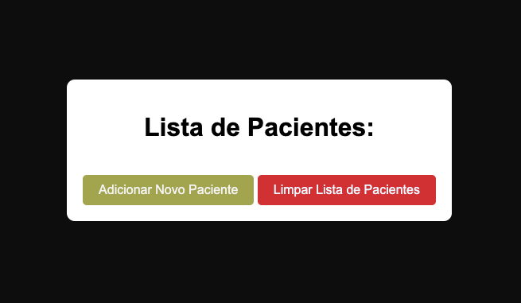
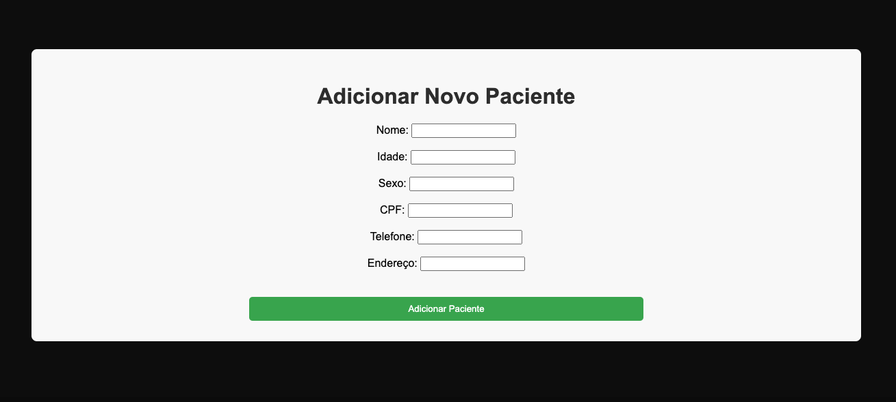
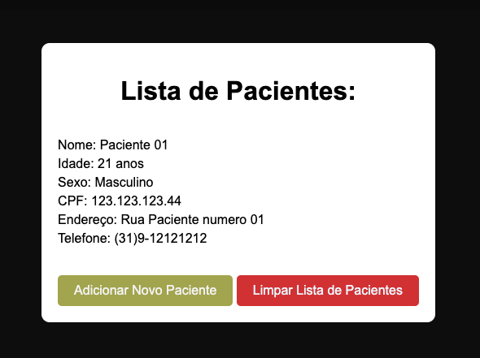

# Título:🖥️ Gestão Hospitalar

Este projeto cria lista de pacientes e armazena os dados em arquivo DB.

### Descrição do projeto:

Este projeto cria um DataBase de pacientes, lista os dados em tela e permite também limpar os dados.

Uma página HTML foi criada para cadastrar um paciente, e exibir os dados digitados. Também foi criada
a página para adicionar um novo paciente.
Dois arquivos CSS vão estilizar as paginas. (styles.css e novo_paciente.css)

### Tecnologias usadas: Python

### Status:🚧 Projeto em Desenvolvimento

### Instalação e execução do projeto

`pip install Flask`

para verificar se o Flask foi instalado.
`pip show Flask`

Para criar o ambiente virtual.
` python3 -m venv venv`

Para rodar o projeto.
`python app.py`

### Imagens

 

 

